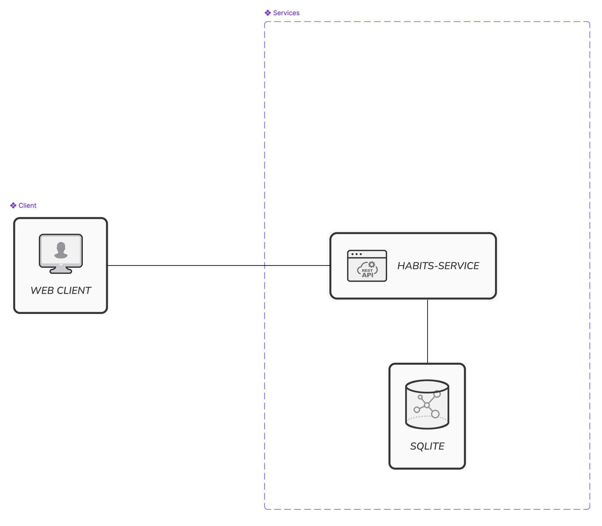

# adaptive-habits
Habit tracker that adapts to the user's progress. Using algorithm's that decrease/increase the target values for each habit depending on activity. Implementing Dynamic Difficulty Adjustment (DDA) to keep the user engaged and increase retention. The goal is to give the user just enough of a challenge to improve, but as low friction as possible to continue. 

## Project Roadmap
This project is currently **in development** (not yet MVP stage). The core habit tracking, entry logging, and basic calendar features are functional.

### Next Steps
1. User Authentication: Register and Login pages, secure API endpoints with JWT, and remove the development user fallback.
2. Adaptive Logic: Algorithms to update habit target values.
3. Agent Integration & AI function/tool calling: AI Agent panel to handle natural language requests for logging and modifying habits and entries.
4. Improve client responsiveness for mobile use.

# Development
This repo follows a monorepo-structure. 
- clients/ is where the webapp is located. 
- services/ contains the backend API's

## Run dev app
```bash
make dev
```
...and clean up:
```bash
make clean
```

## Run production app
```bash
make up
```
...or use docker compose.

Clean up with:
```bash
make down
```

# Architecture Diagram
<!--  -->
